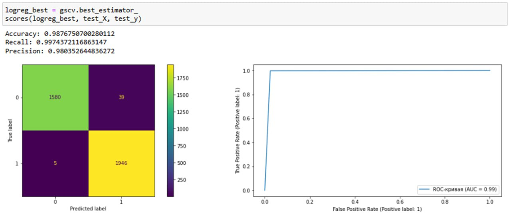

# Курсовая работа по ML

### Работу выполнили
|Фио|Роль|Группа|
|---------------|----------------------|----------|
|Лагуткина Мария|Подготовка модели|М8О-109Б-23|
|Савин Александр|Подготовка данных|М8О-114Б-23|
|Сприридонов Кирилл|Сбор решения задачи|М8О-107Б-23|

#### Описание датасета
Это набор данных, созданный для классификации риса. 

Датасет [Rice type classification](https://www.kaggle.com/datasets/mssmartypants/rice-type-classification?resource=download). Требуется предсказать тип риса (Jasmine - 1, Gonen - 0), основываясь на его признаках (площадь, средняя ширина и длина, скругленность и т.д.)

#### Модель для бинарной классификации
Для решения задачи был написана реализоция логистической регрессии. Сеть состоит из линейного слоя, сигмиоды и функции потерь (binary cross entropy loss, так как задача состоит в бинарной классификации).
Также есть настраиваемый параметр -- кол-во входных признаков.

Алгоритм обучения сети — стохастический градиентный спуск с постоянным шагом.

#### Результат работы модели

